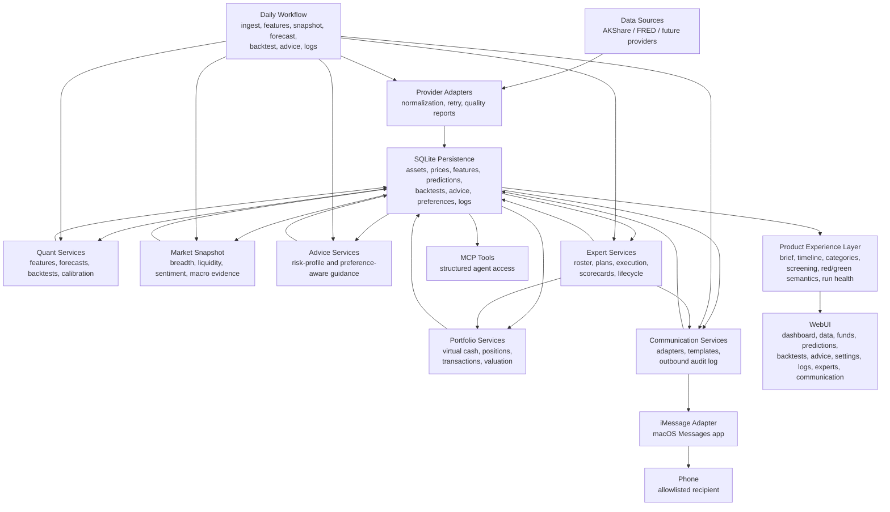

# Architecture

## System Summary

The MVP is a local-first Python system with SQLite persistence, structured data
services, quantitative analysis services, MCP tools for AI access, a scheduled
daily analysis workflow, and a WebUI workbench.

```text
Data sources
  -> data adapters
  -> cleaning, validation, and incremental updates
  -> SQLite persistence
  -> feature, forecast, backtest, and advice services
  -> MCP tools and scheduled daily job
  -> WebUI
```

## Architecture Maintenance Rules

Agents must keep this document, `CODE_INDEX.md`, and task/spec documents aligned
with implementation changes. This is a project hygiene requirement, not an
optional documentation pass.

- Update the system diagram when a new runtime surface, data flow, route family,
  service layer, automation stage, MCP capability, or persistence area is added.
- Update module sections when responsibilities move, a module boundary changes,
  or a new shared helper replaces route-specific or command-specific logic.
- Update `CODE_INDEX.md` when important files, commands, WebUI routes, database
  tables, tests, or task families are added, renamed, removed, or materially
  repurposed.
- Before implementing a feature, inspect whether an existing module already
  owns the capability. Reuse and extend the owner rather than creating a
  parallel path.
- If a feature requires crossing module boundaries, document the intended data
  flow and ownership before editing.
- If a feature introduces a durable architectural choice, create or update an
  ADR in `decisions/`.

## Boundaries

- Data adapters own vendor-specific field mapping and retry behavior.
- Persistence owns schemas, migrations, and database access.
- Quant services own indicators, forecasts, backtests, and scoring.
- Advice services own conversion of structured model outputs into risk-profile
  guidance.
- Portfolio services own virtual accounts, cash, positions, transactions, and
  valuation.
- Expert services own virtual expert roster, plans, execution, scorecards,
  reviews, lessons, retirement, and replacement hiring.
- Communication services own channel-neutral outbound messages, recipients,
  delivery policies, adapter configuration, and send audit records.
- MCP tools expose JSON-oriented capabilities to AI agents.
- WebUI reads system outputs and does not invent model results.

## Invariants

- AI-generated prose must be downstream of structured data/model results.
- Forecasts must record model version, horizon, input window, confidence, and
  generated timestamp.
- Backtests must use only data available before each simulated prediction point.
- Daily advice must include aggressive, balanced, and conservative variants.
- Scheduled runs must write `task_logs` regardless of success or failure.
- Phone communication must be opt-in, allowlisted, auditable, and non-blocking
  for core research computation.

## Modules

### Data Sources

- Responsibility: Fetch A-share, index, ETF, public fund, macro, and sentiment
  data through provider adapters.
- Inputs: Provider APIs such as AKShare, later Tushare Pro or macro sources.
- Outputs: Normalized records ready for persistence.
- Forbidden Changes: Upper layers must not consume provider raw fields directly.

### Persistence

- Responsibility: SQLite schema, migrations, data access, and query helpers.
- Inputs: Normalized data, features, predictions, backtests, advice, logs.
- Outputs: Stable records for services, MCP, and WebUI.
- Forbidden Changes: Do not change table contracts without migration and tests.

### Quantitative Services

- Responsibility: Feature calculation, risk metrics, baseline forecasts,
  rolling backtests, and scoring.
- Inputs: Historical price/fund data and stored features.
- Outputs: Forecasts, backtest runs/results, risk metrics, scores.
- Forbidden Changes: Do not allow future leakage or unrecorded model versions.

### Advice Services

- Responsibility: Generate daily risk-aware guidance for aggressive, balanced,
  and conservative profiles.
- Inputs: Market snapshot, forecasts, backtests, risk metrics, historical scores.
- Outputs: Stored daily advice JSON and human-readable summaries.
- Forbidden Changes: Do not output advice without assumptions and risk warnings.

### Portfolio Services

- Responsibility: Manage simulated portfolios, positions, transactions, cash
  ledger, fees/slippage assumptions, and daily valuation.
- Inputs: Stored assets, stored close/nav prices, virtual orders, and portfolio
  configuration.
- Outputs: Virtual portfolio state, transaction history, and equity curves.
- Forbidden Changes: Do not connect to live brokerage APIs or value positions
  with prices that are unavailable for the simulated valuation date.

#### Virtual Portfolio Foundation

- `virtual_portfolios` stores portfolio ownership, initial capital, cash,
  currency, and status.
- `virtual_positions`, `virtual_transactions`, `virtual_cash_ledger`, and
  `virtual_valuations` form the shared accounting path for future advice and
  expert simulations.
- `investment_forecasting.portfolio.accounting` owns buy/sell/no-trade
  recording, unfilled order exceptions, cash updates, positions, and valuation.
- Valuation and fills must use stored `price_daily` prices at or before the
  simulation date; missing prices stay visible through unfilled transactions or
  valuation `missing_prices` details.

### Expert Services

- Responsibility: Manage persisted expert personas, style/focus configuration,
  daily expert plans, simulated execution, scorecards, lifecycle reviews,
  retirement lessons, and replacement hiring.
- Inputs: Expert configuration, portfolio state, features, predictions,
  backtests, market snapshots, fund metadata, daily advice, and historical
  expert lessons.
- Outputs: Expert plans, plan items, execution records, scorecards, lifecycle
  decisions, retired-expert lessons, and replacement candidates.
- Forbidden Changes: Do not model experts as ephemeral prompts only; expert
  behavior and lifecycle must be traceable to persisted structured records.

#### Expert Roster Foundation

- `experts` is the source of truth for expert identity, style labels, focus
  weights, risk budget, maximum drawdown tolerance, allowed asset categories,
  default cash buffer, review cadence, mandate, and lifecycle state.
- `investment_forecasting.experts.roster` owns the default three-expert
  configuration and idempotent initialization.
- The CLI `experts init/list` commands are inspection and bootstrap surfaces;
  later portfolio, planning, execution, and scoring services must reference
  these persisted records instead of recreating personas.

#### Expert Daily Planning Foundation

- `expert_plans` and `expert_plan_items` store one evidence-backed plan per
  expert per day, including action, target asset, target weight/amount,
  rationale, evidence links, risk checks, risk warnings, and execution status.
- `investment_forecasting.experts.planning` converts each expert's persisted
  focus weights and risk limits into deterministic candidate scoring against
  stored predictions, features, market snapshots, and portfolio cash.
- Plan execution calls the shared portfolio accounting service; expert planning
  must not update cash, positions, or transactions directly.
- Plans must reference stored prediction evidence and pass the advice
  compliance guard against certainty language.

#### Expert Scoring And Lifecycle

- `expert_scorecards` stores rolling-window metrics derived from persisted
  virtual valuations, transactions, and expert plans.
- `expert_reviews` stores lifecycle decisions: keep, warn, probation, retire,
  and hire replacement.
- `expert_lessons` stores structured failure/success/hiring lessons, including
  overweighted signals, ignored signals, failed controls, and future hiring
  patterns to avoid.
- `investment_forecasting.experts.scoring` owns scorecard calculation,
  maturity checks, lifecycle transitions, retirement lessons, and
  style-diverse replacement hiring.
- Retirement must require a mature evaluation window and prior warning /
  probation history; a single bad day must not directly remove an expert.

### Communication Services

- Responsibility: Manage outbound message requests, recipients, adapter
  configuration, delivery policy, dry-run sends, idempotency, templates, and
  send audit records.
- Inputs: Daily workflow summaries, run-health alerts, advice summaries,
  expert plans, expert reviews, and explicit user test-send requests.
- Outputs: Outbound message records, adapter results, setup health, and WebUI
  or CLI inspection data.
- Forbidden Changes: Do not call channel APIs directly from investment,
  expert, daily workflow, or WebUI logic; do not send to non-allowlisted
  recipients; do not let communication failure fail the core research run.

### iMessage Adapter

- Responsibility: Deliver outbound messages through the local macOS Messages
  app when explicitly configured and enabled.
- Inputs: Allowlisted recipient identity and rendered safe message body.
- Outputs: Structured delivery status such as sent, dry-run, failed,
  permission-required, recipient-not-allowed, or rate-limited.
- Forbidden Changes: Do not read private Messages history by default, discover
  contacts broadly, or execute investment actions from phone messages.

### MCP Service

- Responsibility: Expose structured tools for data retrieval, forecast,
  backtest, daily advice, and expert committee workflows.
- Inputs: Tool arguments.
- Outputs: JSON-compatible results.
- Forbidden Changes: Do not return unstructured prose where clients need stable
  fields.

#### Expert MCP Workflow

- MCP exposes structured expert tools for roster inspection, latest/daily
  plans, virtual portfolios, scorecards, lifecycle reviews, lessons, daily
  planning, and scoring.
- Expert MCP commands call `investment_forecasting.experts.*` services; they
  must not edit expert tables through ad hoc SQL.
- Planning and scoring tools write `task_logs` so automation runs are auditable.
- MCP output must continue to state or imply virtual research support only, not
  brokerage execution or guaranteed investment outcomes.

### Scheduler

- Responsibility: Trigger the daily 08:00 analysis workflow and persist logs.
- Inputs: Calendar schedule and service configuration.
- Outputs: Updated database records and task logs.
- Forbidden Changes: Do not hide failures or skip logging.

### WebUI

- Responsibility: Display dashboard, research timeline, data, funds,
  predictions, backtests, daily advice, expert committee state, settings, and
  task logs.
- Inputs: API/service/database outputs.
- Outputs: Workbench views for inspection.
- Forbidden Changes: Do not present model outputs as certainty.

### Product Experience Layer

- Responsibility: Convert raw persisted research outputs into user-facing
  product flows such as daily brief, timeline, category navigation, screening,
  red/green market semantics, and run-health summaries.
- Inputs: WebUI view models, stored advice, market snapshots, predictions,
  backtests, task logs, preferences, and asset metadata.
- Outputs: Human-readable view models and UI components that remain traceable
  to underlying records.
- Forbidden Changes: Do not duplicate forecast, advice, or scoring logic inside
  presentation code; product views should explain existing evidence rather than
  inventing new model results.

### Timeline View Model

- Responsibility: Join date-based advice, market snapshots, prediction
  coverage, backtest runs, and task logs into a single research-run history.
- Inputs: `daily_advice`, `market_snapshots`, `model_predictions`,
  `backtest_runs`, and `task_logs`.
- Outputs: WebUI cards with status, source links, change summaries, and
  recovery hints for missing stages.
- Forbidden Changes: Do not recompute forecasts or advice in the timeline; it
  must only summarize persisted evidence.

### Category View Model

- Responsibility: Group persisted research assets into user-facing product
  categories before users inspect raw rows.
- Inputs: `assets.asset_type`, asset names/codes, latest `features_daily`,
  latest `model_predictions`, `market_snapshots`, and `macro_observations`.
- Outputs: Dashboard category drill-ins, `/categories` summaries, category
  asset tables, and selected-asset category context on `/data`.
- Forbidden Changes: Do not create a separate category taxonomy table until the
  existing asset/fund/provider fields are insufficient; category views should
  stay traceable to stored asset records and observable market data.

### Fund Screening View Model

- Responsibility: Turn stored fund metadata and risk/return metrics into
  user-facing screening filters, risk-profile presets, suitability notes, and
  data-completeness explanations.
- Inputs: `fund_info`, latest `features_daily`, `assets`, and active
  `user_preferences` for context.
- Outputs: `/funds` filter form, conservative/balanced/aggressive preset links,
  filtered fund results, missing-metadata labels, and secondary technical
  details.
- Forbidden Changes: Do not infer missing fund metadata or make suitability
  claims beyond persisted metrics; explanations must remain descriptive and
  risk-aware.

### Expert Committee View Model

- Responsibility: Make expert roster, virtual portfolios, plans, scorecards,
  lifecycle reviews, retirements, and lessons inspectable before raw records.
- Inputs: `experts`, `virtual_portfolios`, `virtual_valuations`,
  `expert_plans`, `expert_scorecards`, `expert_reviews`, and `expert_lessons`.
- Outputs: `/experts` overview cards, latest plan/execution table, lifecycle
  states, human-language lessons, and secondary technical details.
- Forbidden Changes: Do not present expert rankings as guaranteed future
  performance; all expert output remains virtual research simulation.

## Current Architecture Diagram



## External Interfaces

- AKShare Python APIs for MVP market and fund data.
- SQLite file/database for local persistence.
- MCP server tools for AI agent integration.
- Codex automation for daily 08:00 workflow.
- Web browser for the local WebUI.
- macOS Messages app and iMessage for the first local phone communication
  adapter.
