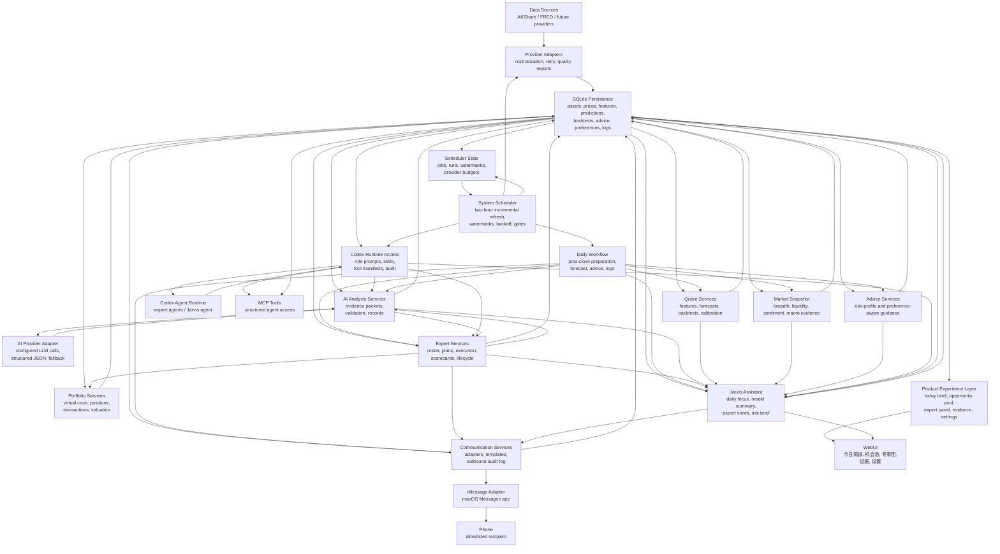

# Architecture

## System Summary

The MVP is a local-first Python system with SQLite persistence, structured data
services, quantitative analysis services, MCP/API tools for AI access,
system-owned scheduled workflows, a Codex agent runtime access layer, and a
Jarvis-first consumer WebUI.

```text
Data sources
  -> data adapters
  -> cleaning, validation, and incremental updates
  -> SQLite persistence
  -> feature, forecast, backtest, and advice services
  -> MCP/API tools and system scheduler
  -> Codex runtime access layer for expert/Jarvis agent tasks
  -> Jarvis consumer WebUI
```

## Architecture Maintenance Rules

Agents must keep this document, `CODE_INDEX.md`, and task/spec documents aligned
with implementation changes. This is a project hygiene requirement, not an
optional documentation pass.

- Update the system diagram when a new runtime surface, data flow, route family,
  service layer, automation stage, MCP capability, or persistence area is added.
- Update module sections when responsibilities move, a module boundary changes,
  or a new shared helper replaces route-specific or command-specific logic.
- Update `CODE_INDEX.md` when important files, commands, WebUI routes, database
  tables, tests, or task families are added, renamed, removed, or materially
  repurposed.
- Before implementing a feature, inspect whether an existing module already
  owns the capability. Reuse and extend the owner rather than creating a
  parallel path.
- If a feature requires crossing module boundaries, document the intended data
  flow and ownership before editing.
- If a feature introduces a durable architectural choice, create or update an
  ADR in `decisions/`.
- If a feature changes first-level WebUI navigation, product naming, route
  ownership, or the Jarvis daily decision journey, it must update
  `SPEC-006`, `CODE_INDEX.md`, `STATUS.md`, and an ADR before implementation is
  considered complete.

## Boundaries

- Data adapters own vendor-specific field mapping and retry behavior.
- Persistence owns schemas, migrations, and database access.
- Quant services own indicators, forecasts, backtests, and scoring.
- Model reliability services own cross-sectional rank scores, validation
  metrics, candidate model comparison, model evidence packets, and promotion
  gates.
- Advice services own conversion of structured model outputs into risk-profile
  guidance.
- News evidence services own provider-neutral news ingestion, deduplication,
  source/time/asset/theme/event/sentiment indexes, time-safe aggregate
  features, and searchable evidence APIs.
- System scheduler services own job registry, due-job selection, two-hour and
  market-calendar-aware triggers, incremental watermarks, provider request
  budgets, backoff/deferred states, and scheduler run audit.
- Codex runtime access services own role-scoped agent runs, project skill
  injection, generated expert/Jarvis prompts, allowed MCP/API tool manifests,
  output submission contracts, runtime metadata, and run/tool-call audit.
- AI analysis services own versioned prompt/schema contracts, structured
  evidence packets, provider-backed or deterministic analysis output,
  validation gates, and traceable handoff into expert plans and Jarvis briefs.
- Portfolio services own virtual accounts, cash, positions, transactions, and
  valuation.
- Expert services own virtual expert roster, plans, execution, scorecards,
  reviews, lessons, retirement, and replacement hiring.
- Communication services own channel-neutral outbound messages, recipients,
  delivery policies, adapter configuration, and send audit records.
- Jarvis services own top-level assistant synthesis from market information,
  prediction models, expert system outputs, user context, and risk warnings.
- MCP tools expose JSON-oriented capabilities to AI agents.
- System schedulers own trigger timing. Codex must not be treated as the
  scheduler; it is invoked by this system as a runtime for specific expert or
  Jarvis tasks.
- WebUI reads system outputs and does not invent model results.

## Invariants

- AI-generated prose must be downstream of structured data/model results.
- AI analysis must be persisted as structured evidence-backed records before it
  is used for expert plans, Jarvis briefs, WebUI display, MCP output, or phone
  notification.
- Forecasts must record model version, horizon, input window, confidence, and
  generated timestamp.
- Model reliability metadata must make point-return forecasts secondary to
  rank score, calibrated probability, risk-adjusted score, validation status,
  and degradation reasons when those fields are available.
- Prediction reliability metadata lives in the sidecar
  `model_prediction_reliability` table keyed by `prediction_id`, so old
  `model_predictions` consumers keep working while reliability-aware views,
  MCP tools, and future Jarvis gates can join rank and validation evidence.
- Candidate models must not become Jarvis-primary without promotion evidence
  against `baseline_mean_v1`.
- Backtests must use only data available before each simulated prediction point.
- Daily advice must include aggressive, balanced, and conservative variants.
- Scheduled runs must write `task_logs` regardless of success or failure.
- Scheduled market/news refreshes must be incremental by watermark and bounded
  window. Hourly jobs must not run full-history ingestion, must skip scopes
  already current, and must honor provider request budgets and backoff.
- Codex app automations must not be used for market/news refreshes. Codex is a
  downstream role runtime invoked by this system for expert/Jarvis agent tasks,
  not the system scheduler.
- Phone communication must be opt-in, allowlisted, auditable, and non-blocking
  for core research computation.
- Jarvis must synthesize persisted evidence; it must not become a separate
  unsupported prediction engine.
- News must be retrieved through structured services or MCP tools when needed;
  it must not be dumped wholesale into fixed AI prompts.
- Codex expert/Jarvis agents must use role-scoped MCP/API tools and submit
  results back through system APIs. They must not write SQLite directly, scrape
  WebUI pages for evidence, or call shell commands to mutate product state.
- Expert T-day agent runs must finish as completed, skipped, failed, or
  validation_failed before Jarvis T+1 readiness can pass.
- Jarvis T+1 analysis must link to the prior day expert outcomes or explicitly
  state which expert evidence was skipped/failed/missing.
- The WebUI must preserve the Jarvis consumer IA: 今日简报, 机会池, 专家团, 证据,
  设置. Technical module routes are allowed only as secondary drill-downs or
  direct agent links.
- Visible product chrome should identify the product as Jarvis 理财助理 rather
  than a generic investment forecasting workbench.

## Modules

### Data Sources

- Responsibility: Fetch A-share, index, ETF, public fund, macro, and sentiment
  data through provider adapters.
- Inputs: Provider APIs such as AKShare, later Tushare Pro or macro sources.
- Outputs: Normalized records ready for persistence.
- Provider access must be sequential and polite by default for residential
  broadband: AKShare calls use configurable minimum delay, optional jitter,
  retry backoff, and throttling diagnostics.
- AKShare is the default free provider. Tushare Pro is an explicit optional
  provider selected through CLI flags and requires a user-supplied token; its
  normalized rows still write to the existing provider-neutral tables with
  `source='tushare'`.
- `investment_forecasting.data.classification` provides deterministic
  industry/theme labels from stored asset code, name, asset type, and fund
  type. It is a product-layer classification helper, not a substitute for a
  future provider-backed industry or holdings taxonomy.
- `investment_forecasting.data.capital_flow` persists provider-neutral
  capital-flow observations. AKShare-specific money-flow APIs are normalized in
  the provider adapter before WebUI or future advice/Jarvis logic reads them.
- `investment_forecasting.data.fund_holdings` persists public-fund holding
  reports. Provider-specific quarterly holding fields are normalized before
  WebUI look-through summaries or future deeper analytics read them.
- `investment_forecasting.data.news` persists provider-neutral financial news
  evidence from bounded source/time windows. Provider-specific Tushare `news`
  rows are normalized, deterministically linked/tagged, and aggregated into
  time-safe features before future search, MCP, or Jarvis reads them.
- Forbidden Changes: Upper layers must not consume provider raw fields directly.

### News Evidence Services

- Responsibility: Ingest optional provider news flashes, deduplicate records,
  link news to stored assets/themes, tag event type and directional sentiment,
  build time-safe aggregate features, and expose bounded search results.
- Inputs: Optional Tushare `news` provider rows, stored asset metadata,
  deterministic theme classifier, query filters from MCP/Jarvis/Codex AI.
- Outputs: `news_items`, `news_item_links`, `news_item_tags`, optional
  `news_feature_daily`, and a structured retrieval service/tool.
- Retrieval boundary: Codex AI and Jarvis should call `search_news_evidence`
  or the equivalent service when news context is needed. Fixed prompts should
  contain the tool contract and retrieval policy, not bulk news text.
- Forbidden Changes: Do not use news as a standalone buy/sell signal; do not
  query provider raw fields from AI prompts; do not create unbounded news
  dumps; do not use news published after prediction time in feature/backtest
  paths.

### Persistence

- Responsibility: SQLite schema, migrations, data access, and query helpers.
- Inputs: Normalized data, features, predictions, backtests, advice, logs.
- Outputs: Stable records for services, MCP, and WebUI.
- Ingestion owns incremental update policy: before provider history calls it
  checks local `price_daily` and resumes from the day after the latest stored
  observation, or skips the provider call when the requested range is already
  covered.
- `capital_flow_observations` stores dated market/stock/sector/fund flow
  subjects with stable main/super-large/large/medium/small inflow fields and
  raw payloads for audit.
- `fund_holdings` stores report-period public-fund holdings with normalized
  holding code/name, weight, shares, market value, rank, source, and optional
  links to locally tracked stock assets.
- Forbidden Changes: Do not change table contracts without migration and tests.

### Quantitative Services

- Responsibility: Feature calculation, risk metrics, baseline forecasts,
  rolling backtests, benchmark selection, scoring, calibration, model
  monitoring, rank validation, and model reliability reporting.
- Inputs: Historical price/fund data and stored features.
- Outputs: Forecasts, backtest runs/results, risk metrics, scores,
  calibration reports, model monitoring reports, replay audit reports, and
  model-health fact rows.
- Forbidden Changes: Do not allow future leakage or unrecorded model versions.
- Model reliability policy: introduce interpretable candidate models before
  tree/deep models; evaluate candidates with IC, Rank IC, bucket spread,
  same-category performance, asset-type performance, and gap/purge/embargo
  controls for overlapping labels.
- Model replay policy: current-year replay audits must use only local stored
  history available on each prediction date, persist replay evidence separately
  from operational `model_predictions`, score only matured outcome windows, and
  produce model accuracy/confidence tuning recommendations before any algorithm
  default changes. Expert committee predictions, Jarvis conclusions,
  investment advice, MCP/WebUI surfaces, and portfolio outcomes are outside the
  first replay-audit scope.
- Model applicability policy: model roles are context-specific. A model/horizon
  can be a valid allocation-bias signal while invalid as a same-type ranking
  signal. Routing changes must run shadow-only until future review, and
  `router_floor70_cap05` must not alter operational `model_predictions`.
  Same-type ranking is disabled when same-type Rank IC or bucket spread is
  non-positive. Raw confidence is evidence quality, not success probability.
- Model-health fact layer: `model_health_metrics` persists replay-derived
  metrics by replay run, model, horizon, asset type, same-category key,
  prediction month, and evaluation window. It is generated from matured
  `model_replay_predictions` only and remains model-layer evidence until later
  applicability/profile tasks explicitly consume it.
- Model-applicability profile layer: `model_applicability_profiles` derives
  context-specific output roles from `model_health_metrics` and records the
  source metric id plus rationale. Same-type ranking is disabled when
  same-category Rank IC or bucket spread is non-positive; profile generation
  does not update operational forecasts or downstream product behavior.
- Shadow-router evidence layer: `model_shadow_routes` persists
  `router_floor70_cap05` monthly weights, training cutoff, turnover, shadow
  metrics, fixed-baseline comparison, and guardrail metadata. It is generated
  from replay rows only, keeps status `shadow_only`, and cannot write
  `model_predictions`.
- Confidence calibration labels: model-health and applicability records carry
  conservative `confidence_label` values. Labels treat raw confidence as
  evidence quality, not success probability; strong labels require positive
  rank/bucket evidence, controlled calibration/overconfidence metrics, and
  multiple matured monthly windows.
- Monthly governance reviews: `model_governance_reviews` persists
  review-only monthly summaries generated from health, applicability,
  confidence-label, and shadow-router evidence. Reviews answer safe-default,
  continue-shadow, downgrade/disable, and promotion-review questions, record
  promotion blockers, and keep `production_defaults_changed=0` unless a future
  product review explicitly approves promotion.
- `investment_forecasting.quant.benchmarks` owns benchmark selection for
  stored scoring workflows: funds prefer same-bucket peer-average benchmarks,
  then fall back explicitly to stored 沪深300 history; non-fund assets use
  stored 沪深300 where available.

#### Model Monitoring

- `model_monitoring_reports` stores per-date/per-model health status, latest
  prediction/backtest dates, input staleness, prediction score, risk score,
  benchmark excess, overall score, score drift, warnings, and raw metrics.
- `investment_forecasting.quant.monitoring` summarizes stored
  `backtest_runs.metrics_json` and `model_predictions` by model version.
- Daily workflow runs monitoring after advice/outcome scoring so degraded
  model health is logged even when no Jarvis brief is generated.
- WebUI `/backtests` surfaces the latest monitoring status before raw
  backtest rows.

### Advice Services

- Responsibility: Generate daily risk-aware guidance for aggressive, balanced,
  and conservative profiles, plus allocation evidence.
- Inputs: Market snapshot, forecasts, backtests, risk metrics, historical
  scores, stored feature metrics, and active user preferences.
- Outputs: Stored daily advice JSON, human-readable summaries, and
  target-volatility allocation proposals bounded by user max-equity/min-cash
  settings. Correlation risk-budget evidence estimates approximate bucket
  risk contribution from stored price history and target-volatility candidate
  assets. Capital-flow observations are attached as auxiliary liquidity and
  crowding evidence IDs when available. Matured advice outcome scores persist
  the chosen benchmark identity/source so historical scores can be audited.
- Forbidden Changes: Do not output advice without assumptions and risk warnings.

### AI Analysis Services

- Responsibility: Persist and validate structured AI-analysis records before
  they influence expert plans, Jarvis briefs, WebUI, MCP, or future phone
  summaries.
- Inputs: Expert configuration, portfolio state, model predictions, features,
  market snapshots, scorecards, valuations, user preferences, and task health.
- Outputs: `ai_analysis_records` with evidence packets, structured output,
  validation metadata, source/version/status, and links to experts or Jarvis
  briefs.
- Implementation: `investment_forecasting.ai_analysis` provides prompt/schema
  constants, provider request builders, deterministic fallback output, and
  provider/fallback metadata in validation JSON. Provider-backed generation
  preserves the same evidence/output/validation contract.
- Provider boundary: `investment_forecasting.ai_providers` owns provider
  request/response/config dataclasses, runtime environment discovery,
  timeout/error fallback mapping, fake-provider tests, provider metadata, and
  future model SDK/API calls. Expert, Jarvis, MCP, WebUI, workflow, and
  communication modules must not import model SDKs directly.
- Prompt boundary: prompt builders create expert/Jarvis instructions from
  structured evidence packets, require explicit `search_news_evidence`
  retrieval for news context, and must not query SQLite or add market facts
  outside the packet.
- Failure policy: missing credentials, timeout, malformed output, unsupported
  evidence claims, unsafe certainty language, or validation failure must write
  a task log and fall back to deterministic analysis unless a task explicitly
  runs in provider-required test mode.
- Jarvis confidence policy: stale, degraded, low-confidence, or outlier model
  signals must be recorded as confidence gates and described as watch-only
  signals before they reach WebUI, MCP, or phone summaries.
- Forbidden Changes: Do not use hidden LLM memory, unsupported market facts,
  unlinked predictions, or unchecked certainty language.

### Codex Runtime Access Services

- Responsibility: Bridge system-owned schedules and Codex role execution.
  This layer starts role-scoped Codex agent runs, injects project skills and
  generated prompts, exposes an allowed tool manifest, records runtime/tool
  metadata, receives structured submissions, and hands output to system
  validators.
- Inputs: Prepared market/model/news evidence, active expert roster, expert
  portfolios, scorecards, lessons, user preferences, run date, target evidence
  date, role key, and trigger reason.
- Outputs: `agent_runs`, `agent_tool_calls`, validated expert
  submissions, validated Jarvis submissions, task logs, and links from expert
  plans or Jarvis briefs to the producing agent run.
- Runtime rule: scheduling belongs to the system. Codex is invoked for a
  specific expert or Jarvis task and receives only role-scoped MCP/API tools.
- Protocol rule: all runtime launchers must conform to the project
  `codex_agent_runtime_v1` adapter contract: prepare, start, poll, cancel, and
  collect result. The preferred completion path is tool-based submission back
  through system APIs; artifact fallback is allowed only when the system reads,
  validates, and persists the artifact through the same service validators.
- Current implementation: `TASK-080` through `TASK-084` provide the audit
  tables, runtime dataclasses, service helpers, fake adapter, local Codex CLI
  integration, readiness/smoke commands, per-run artifact directories,
  role-scoped manifests, prompt rendering, submission envelope tools, agent
  tool-call audit, expert T-day execution, and Jarvis T+1 readiness/brief
  persistence.
- Runtime artifact layout: each local Codex run stores artifacts under
  `data/agent_runtime/runs/<agent_run_id>/`, including `request.json`,
  `prompt.md`, `output_schema.json`, `events.jsonl`, `last_message.txt`,
  `stderr.log`, and reserved `result.json`. SQLite stores the paths and hashes
  in `agent_runs.runtime_metadata_json`.
- Local Codex CLI policy: `CodexCliRuntimeAdapter` invokes `codex exec` in
  non-interactive mode with `--ask-for-approval never` and
  `--sandbox workspace-write` by default. It uses the local Codex configured
  model unless runtime policy or `INVESTMENT_FORECASTING_CODEX_MODEL`
  explicitly sets one. `--dangerously-bypass-approvals-and-sandbox` is
  available only through explicit runtime policy for externally isolated runs.
  Authentication is not bypassed; readiness must pass `codex login status`
  before scheduled runtime execution.
- Local trigger policy: on macOS, `scheduler install-cron` installs one
  system-owned LaunchAgent, `local.investment-forecasting.scheduler`, that
  wakes `scheduler run-due`. These jobs call the same scheduler/runtime adapter
  paths as manual operations and are not Codex app automations.
- Expert ordering: active experts run on T day after system evidence is
  prepared. Each expert must complete one virtual action outcome or explicitly
  skip/fail.
- Jarvis ordering: Jarvis runs at T+1 after T expert outcomes are complete or
  explicitly skipped/failed. Pending expert runs block Jarvis readiness.
- Relationship to `ai_providers`: provider adapters remain a fallback or
  simple LLM boundary. They do not replace agent runtime execution for the
  final expert/Jarvis product shape.
- Forbidden Changes: Do not let Codex own the scheduler, write directly to
  SQLite, scrape WebUI for evidence, bypass validation, use unbounded tool
  access, or create open-ended multi-agent debate loops in the MVP.

### Portfolio Services

- Responsibility: Manage simulated portfolios, positions, transactions, cash
  ledger, fees/slippage assumptions, and daily valuation.
- Inputs: Stored assets, stored close/nav prices, virtual orders, and portfolio
  configuration.
- Outputs: Virtual portfolio state, transaction history, and equity curves.
- Runtime surfaces: Generic `investment-forecasting portfolio create/list/trade/value`
  commands and the `/portfolios` WebUI route; expert services reuse the same
  accounting path for expert-owned portfolios.
- Forbidden Changes: Do not connect to live brokerage APIs or value positions
  with prices that are unavailable for the simulated valuation date.

#### Virtual Portfolio Foundation

- `virtual_portfolios` stores portfolio ownership, initial capital, cash,
  currency, and status.
- `virtual_positions`, `virtual_transactions`, `virtual_cash_ledger`, and
  `virtual_valuations` form the shared accounting path for future advice and
  expert simulations.
- `investment_forecasting.portfolio.accounting` owns buy/sell/no-trade
  recording, unfilled order exceptions, cash updates, positions, and valuation.
- Valuation and fills must use stored `price_daily` prices at or before the
  simulation date; missing prices stay visible through unfilled transactions or
  valuation `missing_prices` details.

### Expert Services

- Responsibility: Manage persisted expert personas, style/focus configuration,
  daily expert plans, simulated execution, scorecards, lifecycle reviews,
  retirement lessons, and replacement hiring.
- Inputs: Expert configuration, portfolio state, features, predictions,
  backtests, market snapshots, fund metadata, daily advice, and historical
  expert lessons.
- Outputs: Expert plans, plan items, execution records, scorecards, lifecycle
  decisions, retired-expert lessons, and replacement candidates.
- Forbidden Changes: Do not model experts as ephemeral prompts only; expert
  behavior and lifecycle must be traceable to persisted structured records.
- Agentic product rule: each active expert is ultimately executed as a
  role-scoped Codex agent using that expert's persisted mandate, style, focus
  weights, portfolio state, scorecard, lessons, allowed tools, and structured
  output schema. Deterministic planning can remain as fallback, but it must not
  be presented as completed agentic execution.

#### Expert Roster Foundation

- `experts` is the source of truth for expert identity, style labels, focus
  weights, risk budget, maximum drawdown tolerance, allowed asset categories,
  default cash buffer, review cadence, mandate, and lifecycle state.
- `investment_forecasting.experts.roster` owns the default four-expert
  historical-persona configuration, idempotent initialization, and retirement
  of obsolete style-named roster entries.
- The CLI `experts init/list` commands are inspection and bootstrap surfaces;
  later portfolio, planning, execution, and scoring services must reference
  these persisted records instead of recreating personas.

#### Expert Daily Planning Foundation

- `expert_plans` and `expert_plan_items` store one evidence-backed plan per
  expert per day, including action, target asset, target weight/amount,
  rationale, evidence links, risk checks, risk warnings, and execution status.
- `ai_analysis_records` stores the pre-plan expert AI analysis; each expert
  receives a style-specific evidence packet and persists structured reasoning
  before a validated plan is generated.
- `expert_plans.ai_analysis_id` links the plan to the analysis record used for
  finalization.
- `investment_forecasting.experts.planning` converts each expert's persisted
  focus weights and risk limits into deterministic candidate scoring against
  stored predictions, features, market snapshots, and portfolio cash.
- Plan execution calls the shared portfolio accounting service; expert planning
  must not update cash, positions, or transactions directly.
- Plans must reference stored prediction evidence and pass the advice
  compliance guard against certainty language. New plans must also reference
  stored AI analysis evidence.

#### Expert Scoring And Lifecycle

- `expert_scorecards` stores rolling-window metrics derived from persisted
  virtual valuations, transactions, and expert plans.
- `expert_reviews` stores lifecycle decisions: keep, warn, probation, retire,
  and hire replacement.
- `expert_lessons` stores structured failure/success/hiring lessons, including
  overweighted signals, ignored signals, failed controls, and future hiring
  patterns to avoid.
- `investment_forecasting.experts.scoring` owns scorecard calculation,
  maturity checks, lifecycle transitions, retirement lessons, and
  style-diverse replacement hiring.
- Retirement must require a mature evaluation window and prior warning /
  probation history; a single bad day must not directly remove an expert.

### Communication Services

- Responsibility: Manage outbound message requests, recipients, adapter
  configuration, delivery policy, dry-run sends, idempotency, templates, and
  send audit records.
- Inputs: Daily workflow summaries, run-health alerts, advice summaries,
  expert plans, expert reviews, and explicit user test-send requests.
- Outputs: Outbound message records, adapter results, setup health, and WebUI
  or CLI inspection data.
- Persistence: `communication_recipients`, `communication_adapter_configs`,
  and `outbound_messages` store allowlists, adapter policy/configuration,
  idempotency keys, statuses, timestamps, and structured errors.
- Runtime surfaces: `investment-forecasting communication
  configure-adapter/list-adapters/upsert-recipient/list-recipients/verify-setup/send-test/list-messages`
  provides setup health, dry-run, explicit real-send, and audit workflows.
- WebUI surface: `/communication` shows adapter health, local iMessage
  preflight checks, masked allowlisted recipients, dry-run test send controls,
  recent outbound status/error summaries, and secondary technical details
  without making raw payloads the primary experience.
- Templates: `investment_forecasting.communication.templates` renders concise
  phone-safe daily success/failure, provider warning, expert plan, probation,
  retirement/replacement, and Jarvis daily-summary messages from persisted
  evidence. Workflow, expert, and Jarvis modules may opt in to sends by
  recipient key, but still route through `send_outbound_message` for policy,
  idempotency, and audit.
- Forbidden Changes: Do not call channel APIs directly from investment,
  expert, daily workflow, or WebUI logic; do not send to non-allowlisted
  recipients; do not let communication failure fail the core research run.

### iMessage Adapter

- Responsibility: Deliver outbound messages through the local macOS Messages
  app when explicitly configured and enabled.
- Inputs: Allowlisted recipient identity and rendered safe message body.
- Outputs: Structured delivery status such as sent, dry-run, failed,
  permission-required, recipient-not-allowed, or rate-limited.
- Implementation: `investment_forecasting.communication.imessage` is the only
  module that builds or executes AppleScript. It uses `osascript` through a
  testable adapter boundary, maps common macOS Automation/TCC failures to
  `permission_required`, and exposes config/allowlist/system setup checks for
  CLI/WebUI surfaces.
- Forbidden Changes: Do not read private Messages history by default, discover
  contacts broadly, or execute investment actions from phone messages.

### Future Inbound Phone Commands

- Responsibility: Any future phone-originated command service must parse only
  allowlisted, authenticated, nonce-bound, audited, non-trading commands.
- Current decision: iMessage is outbound-only and must not be used for inbound
  command execution. See `ADR-006`.
- Allowed future scope: acknowledgement, Jarvis/report regeneration with
  existing settings, status/report resend, non-critical notification pause or
  resume, and local follow-up/reminder creation.
- Forbidden Changes: Do not implement live trading, real-money execution,
  investment-risk preference changes, recipient/allowlist changes, arbitrary
  shell/SQL/Python/AppleScript/MCP/agent execution, or private Messages history
  scraping from phone replies.

### Jarvis Services

- Responsibility: Generate the top-level AI investment assistant brief from
  market information, prediction model output, expert-system virtual investing
  results, and user risk context.
- Inputs: `market_snapshots`, `macro_observations`,
  `capital_flow_observations`, task health,
  `model_predictions`, `backtest_runs`, model quality/degraded states,
  `experts`, `expert_plans`, `expert_scorecards`, virtual portfolio returns,
  expert lifecycle states, `user_preferences`, and risk warnings.
- Outputs: Persisted Jarvis daily briefs with focus directions, one-line
  stance, model summary, expert summaries, combined recommendation, evidence
  references, and risk/freshness warnings.
- Persistence: `jarvis_daily_briefs` stores one idempotent record per
  `(brief_date, version)` with JSON summaries, evidence references, and
  missing/stale evidence metadata. `src/investment_forecasting/jarvis/`
  validates required fields and blocks unsafe certainty language before saving.
- Synthesis: `jarvis/synthesis.py` deterministically gathers stored evidence,
  summarizes model forecasts and every active expert, explains model/expert
  disagreement, summarizes auxiliary capital-flow availability, records missing
  or stale evidence, and writes the result through the Jarvis persistence API.
- AI analysis: Jarvis persists a `jarvis` row in `ai_analysis_records` after it
  reviews market facts, capital-flow evidence, model interpretation, each
  expert's independent AI analysis, expert plans, scorecards, and virtual
  returns. The Jarvis brief evidence stores `capital_flow_ids`,
  `expert_ai_analysis_ids`, and `jarvis_ai_analysis_id`.
- Runtime entry points: `investment-forecasting jarvis generate` creates a
  brief on demand and can optionally send an audited Jarvis phone summary by
  recipient key; `daily run --generate-jarvis` runs Jarvis as an explicit final
  workflow step.
- Jarvis AI analysis runs after expert AI analyses and expert plans are
  available, then separates system facts, model forecasts, expert views,
  expert performance, and Jarvis's final synthesis in the persisted brief.
- Agentic product rule: Jarvis is a T+1 Codex agent. It runs only after T-day
  expert actions are complete or explicitly skipped/failed, reuses the same
  MCP/API evidence tools as experts, additionally reads expert actions,
  scores, current virtual returns, and lifecycle state, then submits the
  consumer-facing daily brief through system validation and persistence.
- Forbidden Changes: Do not hide uncertainty, stale data, model degradation, or
  expert underperformance; do not output opaque buy/sell instructions or
  guaranteed-return language.

### MCP Service

- Responsibility: Expose structured tools for data retrieval, forecast,
  backtest, daily advice, and expert committee workflows.
- Inputs: Tool arguments.
- Outputs: JSON-compatible results.
- Forbidden Changes: Do not return unstructured prose where clients need stable
  fields.

#### Expert MCP Workflow

- MCP exposes structured expert tools for roster inspection, latest/daily
  plans, virtual portfolios, scorecards, lifecycle reviews, lessons, daily
  planning, and scoring.
- Expert MCP commands call `investment_forecasting.experts.*` services; they
  must not edit expert tables through ad hoc SQL.
- Planning and scoring tools write `task_logs` so automation runs are auditable.
- MCP output must continue to state or imply virtual research support only, not
  brokerage execution or guaranteed investment outcomes.

### Scheduler

- Responsibility: Own system scheduling for incremental data/news refresh,
  post-close model preparation, expert T-day agent triggers, Jarvis T+1 agent
  triggers, run audit, and provider-safe pacing. See `SPEC-013` and `ADR-009`.
- Inputs: `scheduler_jobs`, `scheduler_watermarks`, provider rate-limit state,
  market calendar context, service configuration, and task readiness gates.
- Outputs: `scheduler_runs`, `task_logs`, updated market/news/features/model
  records, deferred/backoff states, and health summaries for WebUI/MCP/CLI.
- Current implementation: `TASK-086` through `TASK-089` persist scheduler
  jobs/runs/watermarks and provider backoff state, expose `scheduler
  list-jobs`, `scheduler status`, `scheduler run-due`, and `scheduler run-job`,
  compute bounded incremental work for news/market/price/features, enforce
  provider request budgets/backoff, and surface health through CLI, WebUI, and
  MCP. Provider work is planned through the central scheduler path with
  `real_provider_calls=false` metadata until product enables selected live
  provider execution.
- Two-hour jobs: retrieve only missing news/market context windows since the last
  successful watermark, rebuild only affected news feature scopes, refresh
  data freshness and health, and defer provider calls when request budgets or
  backoff policies require it.
- Post-close jobs: fill only missing `price_daily`/NAV observations, calculate
  features only for affected assets/date ranges, then run forecast, monitoring,
  backtest, advice, and readiness gates when evidence is available.
- Agent jobs: trigger expert Codex runs after the system has prepared T-day
  evidence, and trigger Jarvis T+1 only after T expert outcomes are terminal.
  The local macOS schedule is installed by `scheduler install-cron`: one
  LaunchAgent wakes `scheduler run-due`, experts run at 20:00 Monday-Friday,
  and Jarvis runs at 08:00 daily with the previous weekday as default evidence
  date and communication-adapter notification defaults enabled.
- Forbidden Changes: Do not hide failures or skip logging. Do not introduce
  Codex app automation as a refresh scheduler. Do not schedule full-history
  ingestion or unbounded news scans.

### WebUI

- Responsibility: Display a Jarvis-first consumer information architecture
  with five primary entries: 今日简报, 机会池, 专家团, 证据, 设置. Legacy technical
  routes may remain for direct links and agents, but they must not dominate
  first-level navigation.
- Inputs: API/service/database outputs.
- Outputs: Consumer product views where 今日简报 is the default daily synthesis,
  organized around 今天怎么看 / 为什么 / 能不能信 / 关注哪些资产 / 专家是否一致 /
  风险边界, 机会池 handles asset/product discovery, 专家团 shows expert opinions,
  证据 holds advanced model/data evidence, and 设置 contains preferences,
  communication, system health, and task logs. Technical views such as
  `/market`, `/funds`, `/predictions`, `/backtests`, `/timeline`, `/data`, and
  `/logs` should be reachable as drill-downs or direct routes.
- Forbidden Changes: Do not present model outputs as certainty.
- Forbidden Changes: Do not add primary navigation beyond the five Jarvis
  entries; do not promote raw technical routes back into the consumer path.

### Product Experience Layer

- Responsibility: Convert raw persisted research outputs into user-facing
  product flows such as 今日简报, 机会池, 专家团, 证据, 设置, red/green market
  semantics, run-health summaries, and progressive disclosure of technical
  tables/JSON/logs.
- Inputs: WebUI view models, stored advice, market snapshots, predictions,
  backtests, task logs, preferences, and asset metadata.
- Outputs: Human-readable view models and UI components that remain traceable
  to underlying records, with raw rows kept as secondary technical detail and
  no more than five primary navigation entries.
- Forbidden Changes: Do not duplicate forecast, advice, or scoring logic inside
  presentation code; product views should explain existing evidence rather than
  inventing new model results.
- Forbidden Changes: Do not make raw tables, JSON, logs, provider payloads, or
  model rows the default first-screen experience for consumers.

### Jarvis View Model

- Responsibility: Make Jarvis the first-screen product experience for the
  mature system.
- Inputs: `jarvis_daily_briefs` plus linked market, model, expert, portfolio,
  and task-log evidence.
- Outputs: `/jarvis` and dashboard modules showing today's focus directions,
  model prediction summary, each expert's forecast/score/current return,
  combined recommendation, disagreement notes, and risk boundaries.
- Forbidden Changes: Do not force users to read raw tables before they can
  understand the daily recommendation; raw evidence belongs in drill-downs.

### Timeline View Model

- Responsibility: Join date-based advice, market snapshots, prediction
  coverage, backtest runs, and task logs into a single research-run history.
- Inputs: `daily_advice`, `market_snapshots`, `model_predictions`,
  `backtest_runs`, and `task_logs`.
- Outputs: WebUI cards with status, source links, change summaries, and
  recovery hints for missing stages.
- Forbidden Changes: Do not recompute forecasts or advice in the timeline; it
  must only summarize persisted evidence.

### Category View Model

- Responsibility: Group persisted research assets into user-facing product
  categories before users inspect raw rows.
- Inputs: `assets.asset_type`, asset names/codes, latest `features_daily`,
  latest `model_predictions`, `market_snapshots`, `macro_observations`, and
  deterministic industry/theme labels from asset metadata.
- Outputs: Dashboard category drill-ins, `/categories` summaries, category
  asset tables, `/market` links for macro/market indicators, and selected-asset
  category context on `/data`. Fund, prediction, and market views may display
  the same theme labels for scanability. `/themes` aggregates those labels into
  theme-level coverage, risk/return, expected-return, and representative-asset
  views for allocation research.
- Forbidden Changes: Do not create a separate category taxonomy table until the
  existing asset/fund/provider fields are insufficient; category views should
  stay traceable to stored asset records and observable market data.

### Fund Screening View Model

- Responsibility: Turn stored fund metadata and risk/return metrics into
  user-facing screening filters, risk-profile presets, suitability notes, and
  data-completeness explanations.
- Inputs: `fund_info`, latest `features_daily`, `assets`, `fund_holdings`, and
  active `user_preferences` for context.
- Outputs: `/funds` filter form, conservative/balanced/aggressive preset links,
  filtered fund results, holding theme exposure, missing-metadata labels, and
  secondary technical details.
- Forbidden Changes: Do not infer missing fund metadata or make suitability
  claims beyond persisted metrics; explanations must remain descriptive and
  risk-aware.

### Expert Committee View Model

- Responsibility: Make expert roster, virtual portfolios, plans, scorecards,
  lifecycle reviews, retirements, and lessons inspectable before raw records.
- Inputs: `experts`, `virtual_portfolios`, `virtual_valuations`,
  `expert_plans`, `expert_scorecards`, `expert_reviews`, and `expert_lessons`.
- Outputs: `/experts` overview cards, one multi-expert virtual return
  comparison curve, latest plan/execution table, lifecycle states,
  human-language lessons, expert detail pages, and secondary technical details.
- Forbidden Changes: Do not present expert rankings as guaranteed future
  performance; all expert output remains virtual research simulation.

## Current Architecture Diagram



## External Interfaces

- AKShare Python APIs for MVP market and fund data.
- SQLite file/database for local persistence.
- MCP server tools for AI agent integration.
- Codex agent runtime access layer for role-scoped expert and Jarvis tasks.
- System-owned scheduler for two-hour incremental market/news refresh,
  post-close preparation, provider backoff, expert T-day runs, and Jarvis T+1
  analysis.
- Web browser for the local WebUI.
- macOS Messages app and iMessage for the first local phone communication
  adapter.
